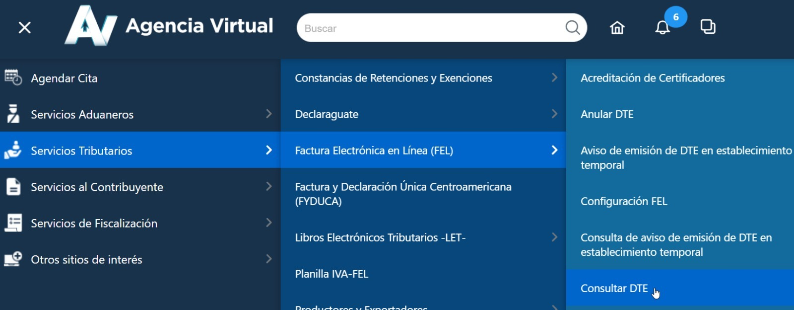
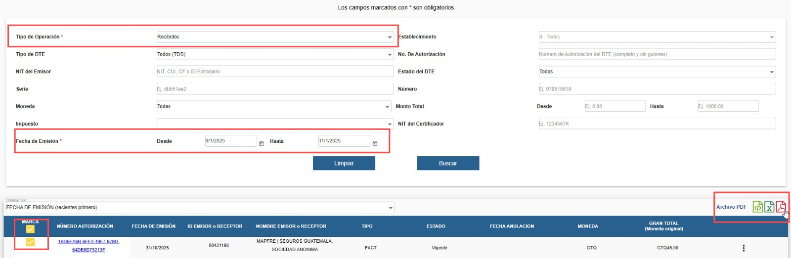

# Descarga de PDFs FEL (SAT) → `data/raw/pdf`

Esta guía explica cómo descargar en lote los PDFs de DTE (FEL) desde SAT y nombrar los ZIPs para el pipeline.

## Acceso

1. Entra a **Agencia Virtual**: <https://farm3.sat.gob.gt/menu/login.jsf>  
2. Navega: **Servicios tributarios → Factura electrónica en línea (FEL) → Consultar DTE**  

   

## Filtros requeridos

- **Tipo de operación**: marcar **Recibidas** (selección manual).
- **Rango de fechas (Emisión)**: variar por bloques estándar (ver abajo).

## Descarga en lote

1. Marca las filas con la casilla **Marca**.
2. Haz clic en el ícono de **PDF** para descargar en ZIP (contiene todos los PDFs seleccionados).

   

> Nota: aprovechando descargar pdfs, se debe de descargar su versión equivalente a xml para meterlos en data/raw/xml

## Estándar de bloques y nombres

Usar **MM/DD/YYYY** y nombrar ZIPs como `<year>_bX.zip`.

| Bloque | Rango de emisión                       | Nombre ZIP   |
|--------|----------------------------------------|--------------|
| b1     | 1/1/`year`  – 3/1/`year`               | `year_b1.zip`|
| b2     | 3/1/`year`  – 5/1/`year`               | `year_b2.zip`|
| b3     | 5/1/`year`  – 7/1/`year`               | `year_b3.zip`|
| b4     | 7/1/`year`  – 9/1/`year`               | `year_b4.zip`|
| b5     | 9/1/`year`  – 11/1/`year`              | `year_b5.zip`|
| b6     | 11/2/`year` – 12/31/`year`             | `year_b6.zip`|

**Ejemplo**: rango 9/1/2025–11/1/2025 ⇒ `2025_b5.zip`.

## Ubicación de entrega

- Coloca los ZIPs en: `data/raw/pdf`
